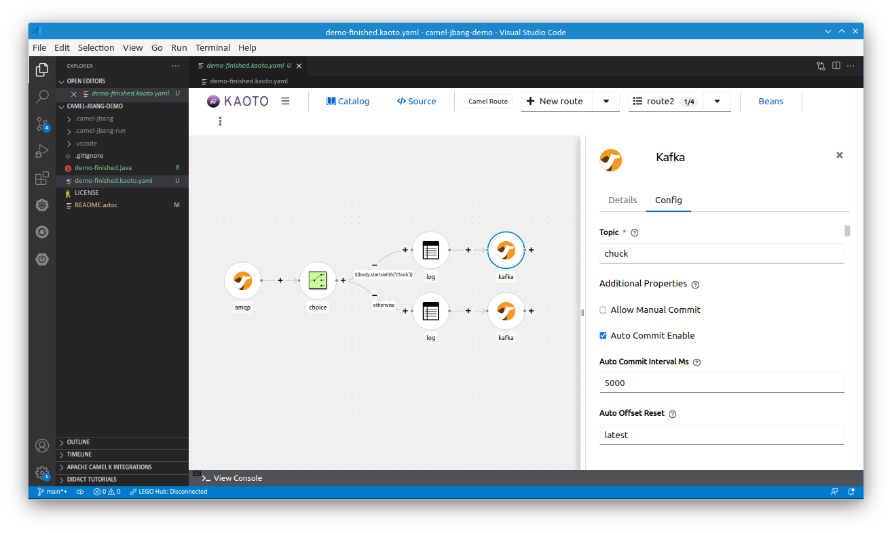

= Camel JBang demo

Prototype some Camel routes with https://access.redhat.com/documentation/en-us/red_hat_build_of_apache_camel/4.4/html/developer_tooling_guide/camel-jbang[Camel JBang CLI]:

* Produce some text messages by getting random jokes from https://api.chucknorris.io/[Chuck Norris API].
* Send the messages to a ActiveMQ Artemis queue.
* Bridge the Artemis queue to a Kafka topic.
* Receive the messages from Kafka.
* Perform some content-based filtering and routing.

== Install Camel CLI & JBang

* https://www.jbang.dev/download/[Install JBang]
+
[source,shell]
----
# e.g. install using SDKMAN
$ sdk install jbang
...
$ jbang -V
0.103.1
----
+
* Install https://access.redhat.com/documentation/en-us/red_hat_build_of_apache_camel/4.4/html/developer_tooling_guide/camel-jbang[Camel CLI]
+
[source,shell]
----
$ jbang app install camel@apache/camel
...
$ which camel
~/.jbang/bin/camel
$ camel -V
4.6.0
----
+
* Install `camel` shell completion
+
[source,shell]
----
$ echo 'source <(camel completion)' >> ~/.bashrc # or similar
----
+
* Explore `camel` options
+
[source,shell]
----
$ camel --help
Usage: camel [-hV] [COMMAND]
Apache Camel CLI
  -h, --help      Show this help message and exit.
  -V, --version   Print version information and exit.
Commands:
  init        Creates a new Camel integration
  run         Run as local Camel integration
  debug       Debug local Camel integration
  log         Tail logs from running Camel integrations
  ps          List running Camel integrations
  stop        Shuts down running Camel integrations
  trace       Tail message traces from running Camel integrations
  transform   Transform message or Camel routes (use transform --help to see
...
----

== Start prototyping a simple Camel route

[source,shell]
----
$ camel init demo.java
----

[TIP]
====
Get the code assist for Camel DSLs and `application.properties` for your favorite IDE:

* https://marketplace.visualstudio.com/items?itemName=redhat.apache-camel-extension-pack[VSCode]
* https://plugins.jetbrains.com/plugin/9371-apache-camel[IntelliJ]
* https://marketplace.eclipse.org/content/jboss-tools[Eclipse]
====

Start editing the Camel route with live reload

[IMPORTANT]
====
As of Camel 4.6.0 and 4.4.2, the https://issues.apache.org/jira/browse/CAMEL-20771[live reload does not work for Java files]. The issue is https://github.com/apache/camel/commit/924ee0ab663562c48d6556a31d90d90272a94753[fixed] but not released yet.
====

[source,shell]
----
$ camel run demo.java --dev
...
INFO 33234 --- [           main] e.camel.impl.engine.AbstractCamelContext :     Started route1 (timer://java)
INFO 33234 --- [           main] e.camel.impl.engine.AbstractCamelContext : Apache Camel 4.6.0 (dem) started in 163ms (build:0ms init:0ms start:163ms)
INFO 33234 --- [ - timer://java] demo.java:14                             : Hello Camel from route1
INFO 33234 --- [ - timer://java] demo.java:14                             : Hello Camel from route1
...
----

Do some changes in the file

[source,java]
----
// camel-k: language=java

import org.apache.camel.builder.RouteBuilder;

public class dem extends RouteBuilder {

    @Override
    public void configure() throws Exception {

        // Write your routes here, for example:
        from("timer:java?period={{time:1000}}")
            .setBody()
                // add JBang on the following line
                .simple("Hello Camel JBang from ${routeId}")
            .log("${body}");
    }
}
----

After that (if you run the https://github.com/apache/camel/commit/924ee0ab663562c48d6556a31d90d90272a94753[fixed] version of Camel, e.g. by adding `--camel-version=4.4.3-SNAPSHOT`) the application should be reloaded
and the changed output should appear on the console:

[source,shell]
----
INFO 33234 --- [ - timer://java] demo.java:14                        : Hello Camel from route1
INFO 34938 --- [rReloadStrategy] .support.RouteWatcherReloadStrategy : Routes reloaded summary (total:1 started:1)
INFO 34938 --- [rReloadStrategy] .support.RouteWatcherReloadStrategy :     Started route2 (timer://java) (source: demo.java:11)
INFO 34938 --- [ - timer://java] demo.java:14                        : Hello Camel JBang from route2
...
----

Have some fun by getting some random jokes from https://api.chucknorris.io/[Chuck Norris API]
by replacing the `from("timer:...").setBody(...)` for `kamelet:chuck-norris-source`:

[source,java]
----
        from("kamelet:chuck-norris-source?period=2000")
            .log("${body}");
----

... and see the live reload working again:

[source,shell]
----
INFO 34938 --- [ - timer://java] demo.java:14                        : Hello Camel JBang from route2
INFO 34938 --- [rReloadStrategy] .support.RouteWatcherReloadStrategy : Routes reloaded summary (total:1 started:1)
INFO 34938 --- [rReloadStrategy] .support.RouteWatcherReloadStrategy :     Started route2 (timer://java) (source: demo.java:11)
INFO 49469 --- [- timer://chuck] demo.java:11                        : Chuck Norris blows up ballons with his nose
----

== Add a legacy messaging broker

Start the broker

[source,shell]
----
$ docker run -e AMQ_USER=admin -e AMQ_PASSWORD=admin -p5672:5672 quay.io/artemiscloud/activemq-artemis-broker:1.0.20
----

Change the route

[source,java]
----
        from("kamelet:chuck-norris-source?period=2000")
            .log("${body}")
            .to("amqp:queue:jokes");
----

It will not work, because we did not configure the connectionFactory

[source,shell]
----
...
org.apache.camel.FailedToStartRouteException: Failed to start route route2 because of connectionFactory must be specified
----

Rather than configuring the connection factory manually,
we may take the advantage of https://camel.apache.org/camel-quarkus/next/reference/extensions/amqp.html#extensions-amqp-additional-camel-quarkus-configuration[Camel Quarkus AMQP extension] that configures the connection factory for us:

[quote]
The extension leverages the https://github.com/amqphub/quarkus-qpid-jms/[Quarkus Qpid JMS] extension. A ConnectionFactory bean is automatically created and wired into the AMQP component for you. The connection factory can be configured via the Quarkus Qpid JMS https://github.com/amqphub/quarkus-qpid-jms#configuration[configuration options].

So we let Camel JBang switch from using plain Camel to using Camel Quarkus under the hood:

[source,shell]
----
$ camel run demo.java --runtime=quarkus
Running using Quarkus v3.10.0 (preparing and downloading files)
...
INFO  [route1] (Camel (camel-1) thread #4 - timer://chuck) Sending to Artemis: Chuck Norris irons his clothes by wearing them.
----

[NOTE]
====
The `--dev` option will not work with `--runtime=quarkus`
====

We see the messages are being sent to Artemis without configuring anything
because the `quarkus-qpid-jms` happens to configure the connestion factory with `localhost:5672` and `admin admin` credentials.

== Bridge the Artemis queue to a Kafka topic

With the above setup, we do not see any exceptions in the console,
but to be sure that the messages pass the Artemis queue,
we better create a consumer that will forward the messages to a Kafka topic straight ahead.
To be sure that the messages pass the Kafka topic, we add another Camel route to consume them.

[source,java]
----
        from("amqp:queue:jokes")
            .log("Forwarding from Artemis to kafka: ${body}")
            .to("kafka:jokes");

        from("kafka:jokes")
             .log("Received from kafka: ${body}");
----

After restarting the app, we see the messages passing both brokers:

[source,shell]
----
INFO  [route1] (Camel (camel-1) thread #4 - timer://chuck) Sending to Artemis: Internet service dies each time someone on your ISP tries to submit a dry Chuck Norris fact.
INFO  [org.apa.qpi.jms.JmsConnection] (AmqpProvider :(5):[amqp://localhost:5672]) Connection ID:8cc380f3-ded1-4895-bce0-25e5d379cdfb:5 connected to server: amqp://localhost:5672
INFO  [route2] (Camel (camel-1) thread #2 - JmsConsumer[jokes]) Forwarding from Artemis to kafka: Internet service dies each time someone on your ISP tries to submit a dry Chuck Norris fact.
INFO  [route3] (Camel (camel-1) thread #3 - KafkaConsumer[jokes]) Received from kafka: Internet service dies each time someone on your ISP tries to submit a dry Chuck Norris fact.
----

== Content-based filtering and routing

Say that we want to do something special with messages starting with `Chuck`.

To do that, we can use the Camel https://camel.apache.org/components/next/eips/choice-eip.html[Choice EIP].
Then, based on the result of the content match, we may want to sent the message to a different Kafka topic:

[source,java]
----
        from("amqp:queue:jokes")
            .choice()
                .when(simple("${body.startsWith('Chuck')}"))
                    .log("Forwarding from Artemis to kafka:chuck: ${body}")
                    .to("kafka:chuck")
                .otherwise()
                    .log("Forwarding from Artemis to kafka:other: ${body}")
                    .to("kafka:other");
----

To be sure that the right jokes pass the right Kafka topic, we add some Kafka consumers:

[source,java]
----
        from("kafka:chuck")
            .log("Received from kafka:chuck: ${body}");

        from("kafka:other")
            .log("Received from kafka:other: ${body}");
----

== Visual editing with Kaoto

https://kaoto.io/[Kaoto] is a visual editor for Camel routes.
The underlying format is YAML.
See the https://kaoto.io/docs/installation/[installation options].

Here, we opened link:demo-finished.kaoto.yaml[] in Kaoto extension for VS code:

== Export to Maven

Once done with prototyping, we may want to setup a real Maven project.
That's pretty easy with Camel JBang:

[source,shell]
----
$ camel export --runtime=quarkus --gav=com.foo:acme:1.0-SNAPSHOT --directory=../camel-quarkus-demo
$ cd ../camel-quarkus-demo
$ ls -l .
total 36
-rwxr--r--. 1 ppalaga ppalaga 11289 May 17 13:21 mvnw
-rwxr--r--. 1 ppalaga ppalaga  7796 May 17 13:21 mvnw.cmd
-rw-r--r--. 1 ppalaga ppalaga  7974 May 17 13:22 pom.xml
drwxr-xr-x. 3 ppalaga ppalaga  4096 May 17 13:21 src
----

== Further resources

* Camel Quarkus Example: https://github.com/apache/camel-quarkus-examples/tree/main/message-bridge[Message bridge between AMQ and IBM MQ with connection pooling and XA transactions]

== Ideas

* Content based routing
* https://developers.redhat.com/products/redhat-build-of-camel/getting-started
